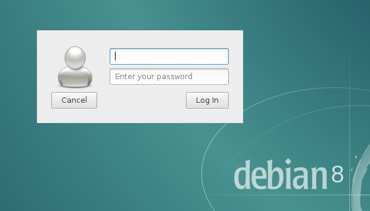
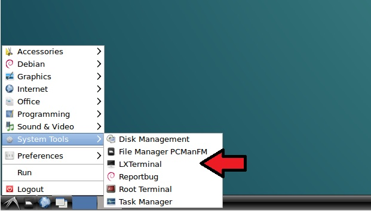
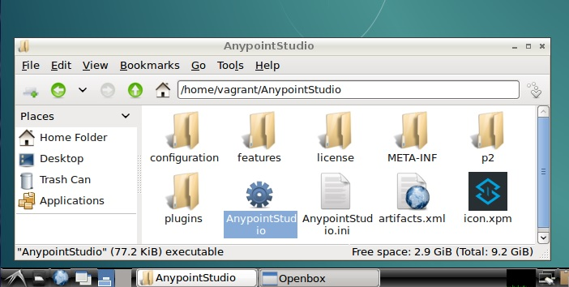
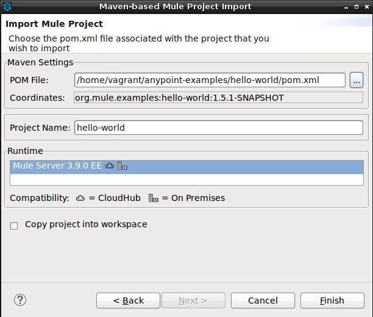

# A Vagrantized MuleSoft 4 Development Environment

## What is this?  

This is a simple virtualized development environment that gets MuleSoft's Anypoint Studio up and running... FAST!

It is intended to get you started.  It can easily be enhanced and configured to fit your specific requirements.  

## Sample Use Cases

1. **I want to kick the tires.**  I'm a technologist that's interested in MuleSoft.  Seeing is believing.  I've talked with people and read documentation but that's not good enough for me.  
1. **I want to train people.**  I'm commited to MuleSoft as a technology and I need to educate my team.   I don't want them to waste their time installing basic prerequisites.
1. **I want a common development environment.**  I'm a tech lead looking for consistency and efficiency.  I don't want developers to ever use the excuse "it works on my machine"!

## Success Criteria

Upon completion you will have two things:

<ol>
<li> A fully functioning environment that includes the following technologies.<p>

| Technology | Purpose | Version |
| --- |:---:| :---:|
| [Chromium](https://www.chromium.org/Home) | Web Browser | [See debian package](https://packages.debian.org/stretch/chromium) |
| [debian](https://www.debian.org/) | Operating System | [stretch](https://www.debian.org/releases/stretch/) |
| [GIT](https://git-scm.com/) | Source Code Management | [See debian package](https://packages.debian.org/stretch/git-all) |
| [Java JDK](https://java.com/en/) | Software Platform | 1.8 |
| [Postman](https://www.getpostman.com/download?platform=linux64) | API Testing Tool | [See Postman](https://www.getpostman.com/) |
| [Atom](https://www.atom.io) | Text Editor | [See Atom](https://www.atom.io) |
| [API Workbench](https://apiworkbench.com) | API RAML Editor | [See API Workbench](https://apiworkbench.com)
| [Maven](https://maven.apache.org/) | Java Build Tool | [See debian package](https://packages.debian.org/stretch/maven) |
| [MuleSoft Anypoint Studio](https://www.mulesoft.com/platform/studio) | Integrated Development Environment | 7.3 |
| [Mule Runtime](https://www.mulesoft.com/platform/mule) | Engine for Anypoint Platform (Server) | 4.1 |
| [lxde](https://lxde.org/) | Desktop Environment | [See debian package](https://packages.debian.org/jessie/metapackages/lxde) |
</li>
<li>
A built and locally deployed MuleSoft application. <p>

| Github Repository | Branch | Project |
| --- |:---:| :---:|
| [mulesoft/anypoint-examples](https://github.com/mulesoft/anypoint-examples/tree/4.1) | 4.1 | hello-world |

</li>
</ol>

## Prerequisites

The following prerequisites are based on:

1. [Release Notes](https://docs.mulesoft.com/release-notes/studio/anypoint-studio-7.3-with-4.1-update-site-1-runtime-release-notes) provided by MuleSoft.
1. Specifications of the host machine used to develop these scripts.  

The software components below are requirements, they are needed.  Other configurations/versions will most likely work with little to no modification.

**_The hardware specs and any versions should be viewed as guidelines and not requirements._**

### 1) Hardware

| Item | Spec | Notes |
| :---: | :---: | --- |
| RAM (for the VM alone) | 4GB | Based on MuleSoft Release Notes. |   
| CPU | 2GHz | Based on MuleSoft Release Notes. |
| Available Hard Drive | 10GB |  Based on MuleSoft Release Notes. |
| OS | Windows 10 | Vagrant and VirtualBox supports many other Operating Systems. |   

### 2) SoftwareS
You need to install the following before getting started.  

| Technology | Purpose | Version | Installation Instructions |
| --- | :---: | :---: | --- |  
| [Vagrant](https://www.vagrantup.com/) | Portable Development Environments | 2.0.2 | Provided by [Vagrant](https://www.vagrantup.com/docs/installation/). |
| [VirtualBox](https://www.virtualbox.org/) | Virtual Machine Provider | 5.1.22 | Provided by [VirtualBox](https://www.virtualbox.org/wiki/Downloads). |
| [Virtual Box Guest Additions](https://www.virtualbox.org/manual/ch04.html) | Better performance and usability | 0.15.1 | Provided via Vagrant Plugin [vagrant-vbguest](https://github.com/dotless-de/vagrant-vbguest).<br>From a command prompt run `vagrant plugin install vagrant-vbguest` |

## Create the Virtual Machine

The next few steps should be performed from the host (Windows) machine.

### 1) Verify Vagrant is properly installed

From a command prompt, run `vagrant -v` to see the version.
```
C:\>vagrant -v
Vagrant 2.0.2
```

### 2) Download (this) GIT repository

From a command prompt:
```
C:\Projects>git clone https://github.com/boblablaw/vagrant-mulesoft-devenv.git
```

### 3) Create and configure the VM using Vagrant

From a command prompt, navigate to the Vagrantfile and run `vagrant up`.

```
C:\Projects>cd vagrant-mulesoft-devenv
C:\Projects\vagrant-mulesoft-devenv>vagrant up
Bringing machine 'default' up with 'virtualbox' provider...
==> default: Checking if box 'debian/jessie64' is up to date...
```

Depending on the speed of your machine and internet connection this **might take a few minutes**.  Upon completion you should see:

```
==> default: If this is your first time running 'vagrant up' please run 'vagrant reload'.

C:\Projects\vagrant-mulesoft-devenv>
```

If you **did** receive errors, fix them and rerun `vagrant up`.  If you want to restart clean, run `vagrant destroy` first.

If you **did not** receive errors, run `vagrant reload` to restart the VM.  

Upon completion you should be presented with a debian login screen.



### 4) Smoke Test the VM
#### Launch MuleSoft's Anypoint Studio

* From the taskbar, select the Applications menu and click "Programming/AnypointStudio"
* Select the workspace `/home/vagrant/AnypointStudio/studio-workspace`

#### Import Test Application into Anypoint Studio and Run

* Create project via `File -> Import -> Mule project from jar`
* Select jar file via `/home/vagrant/testApp.jar`  
* Run the project
* Open a web client ON GUEST (Chromium or Firefox) and make a request to http://localhost:8081/jms.
* Verify that the message: "Accounts sent for processing to JMS queue" is returned
* In a web client, make a request to http://localhost:8081/pop.
* Verify the endpoint returns accounts from the remote MySQL database setup in the project
* OPTIONAL: Check that you can access the endpoints via the HOST machine on port 4567.   

### 5) OPTIONAL - Download additional Mulesoft examples
Login using the credentials `vagrant/vagrant`.  
Launch a terminal via `System Tools -> LXTerminal`.




### Running MuleSoft's "Hello World" Application

The following steps should be performed within the newly created virtual machine.

### 1) Download MuleSoft's Anypoint-Examples

From a terminal:
* Clone the [source code via GIT](https://github.com/mulesoft/anypoint-examples/tree/4.1).
* Nagivate to the `anypoint-examples` directory.
* Checkout the `4.1` branch.

For example:
```
vagrant@mulehost:~$ git clone https://github.com/mulesoft/anypoint-examples.git
Cloning into 'anypoint-examples'...
remote: Counting objects: 15992, done.
remote: Total 15992 (delta 0), reused 0 (delta 0), pack-reused 15992
Receiving objects: 100% (15992/15992), 3.27 MiB | 0 bytes/s, done.
Resolving deltas: 100% (9064/9064), done.
Checking connectivity... done.

vagrant@mulehost:~$ cd anypoint-examples/

vagrant@mulehost:~/anypoint-examples$ git checkout 4.1
Branch 4.1 set up to track remote branch 4.1 from origin.
Switched to a new branch '4.1'
```

### 2) Launch MuleSoft's Anypoint Studio

* From the File Manager navigate to the `/home/vagrant/AnypointStudio` directory.
* Double click `AnypointStudio`
* Select the workspace `/home/vagrant/AnypointStudio/workspace`  



### 3) Import Test Application into Anypoint Studio

* Create project via `File -> Import -> Maven-based Mule Project from pom.xml`   
* Select pom file via `/home/vagrant/anypoint-examples/hello-world/pom.xml`  
* Accept the defaults and click `Finish`  
* Continue with the instructions found [here](https://github.com/mulesoft/anypoint-examples/tree/4.1/hello-world)... and good luck!  



## Next Steps

* Run more examples.  MuleSoft provides many sample projects for demonstration purposes.  
* Map a shared folder?  
